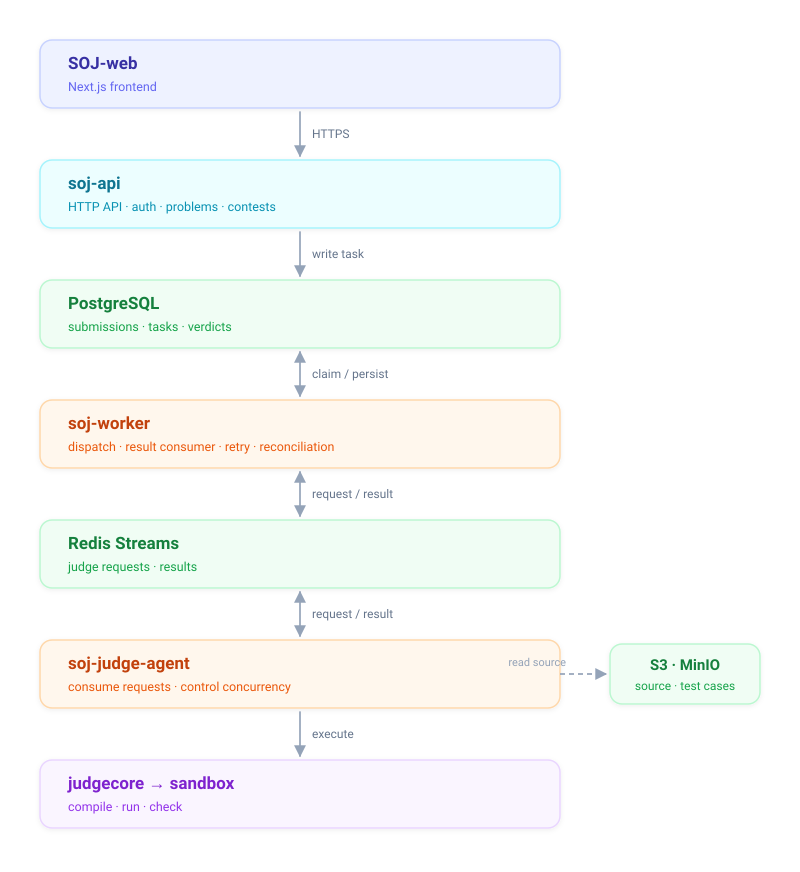

# Sundial Online Judge

[](https://go.dev/)
[](LICENSE)
[](https://github.com/sparklyi/SOJ/actions/workflows/ci.yml)

English | [简体中文](README.zh-CN.md)

**Live demo: <http://43.172.84.99/>**

SOJ (Sundial Online Judge) is a self-hosted online judge for problem authoring, contests, and
automatic judging.

When you submit, the API returns right away. A background process compiles and runs the code in an
isolated sandbox and writes the verdict back to the database, so slow or crashed judging never
blocks the request or loses the submission.

This repository is the Go backend. The Next.js frontend lives in
[SOJ-web](https://github.com/sparklyi/SOJ-web).

## Architecture



| Process | Responsibility |
| --- | --- |
| `soj-api` | HTTP API (Gin): auth, problems, submissions, contests. It writes tasks and never executes code. |
| `soj-worker` | Claims pending tasks, publishes judge requests, consumes results, and handles retries, dead letters, and reconciliation. |
| `soj-judge-agent` | Consumes judge requests, limits concurrency per language, runs `judgecore`, and publishes results. |
| `soj-migrate` | Runs PostgreSQL migrations. |

A submission goes through four steps:

1. `POST /submissions` writes the submission and a queued judge task, then returns `202`.
2. A worker claims the task and publishes a `judge.request.v2` event to a Redis Stream.
3. A judge agent consumes it, compiles and runs the code, and publishes `judge.result.v1`.
4. The worker consumes the result and writes the verdict.

The API and the judge agent never talk to each other; they meet at PostgreSQL and Redis. PostgreSQL
holds the state and Redis only carries messages, so a message delivered twice still writes one
verdict, and a process that dies mid-task costs a little time instead of losing the submission.
Only `soj-judge-agent` can hold the Docker socket, and the containers that run user code get
neither the socket nor any credentials.

SOJ ships **7 languages**: C, C++17, Go, Java, Node.js, Python 3, and Rust. A language is a
directory with a `language.yaml`, so adding one means adding a directory and restarting the API.
The sandbox is swappable — `fake`, `process`, or `docker` (gVisor/`runsc`) — so the whole pipeline
runs without a sandbox runtime.

## Getting started

Requires Docker with Compose v2. Go 1.25 is only needed to run the backend directly.

```bash
make down
make up
make smoke
```

`make smoke` runs the whole flow: register, author a problem, upload test cases, publish, submit,
judge, rejudge, run a contest, and read the scoreboard.

| Service | URL |
| --- | --- |
| API | `http://localhost:8080` |
| Worker health / metrics | `http://localhost:8081` |
| Judge-agent health / metrics | `http://localhost:8082` |
| MinIO console | `http://localhost:9001` |
| Prometheus | `http://localhost:9090` |

Run the processes directly instead of in containers:

```bash
go run ./cmd/soj-migrate
go run ./cmd/soj-api
go run ./cmd/soj-worker
go run ./cmd/soj-judge-agent
```

The frontend is a separate repository:

```bash
git clone https://github.com/sparklyi/SOJ-web.git && cd SOJ-web
npm ci && cp .env.example .env.local && npm run dev   # http://localhost:3000
```

## Documentation

| Document | Contents |
| --- | --- |
| [docs/v2-architecture.md](docs/v2-architecture.md) | Modules, deployment, and observability |
| [docs/v2-api-guide.md](docs/v2-api-guide.md) | API conventions and the response envelope |
| [docs/v2-worker.md](docs/v2-worker.md) | Dispatch, retries, dead letters, and reconciliation |
| [docs/v2-deploy.md](docs/v2-deploy.md) | Configuration and production deployment |
| [docs/judge-runtime-readiness.md](docs/judge-runtime-readiness.md) | Sandbox readiness checks and recovery |
| [docs/observability-trial-loop.md](docs/observability-trial-loop.md) | Dashboards, alerts, and trace diagnosis |

## Contributing

Bug reports and pull requests are welcome.

Fork the repository and clone your fork:

```bash
git clone https://github.com/<your-username>/SOJ.git
cd SOJ
git remote add upstream https://github.com/sparklyi/SOJ.git
git checkout -b fix/short-description
```

Make your changes and run the checks:

```bash
make test            # go test ./...
make vet             # go vet ./...
make lint            # golangci-lint run (needs golangci-lint v2)
make compose-config  # validate every Compose file
```

Push the branch and open a pull request against `main`. Keep commits focused and follow
Conventional Commits. CI runs the same checks plus a Docker smoke test.

## License

Released under the [MIT License](LICENSE).

Contact: WeChat `sparkyi1026` · Email `sparkyi@foxmail.com`
