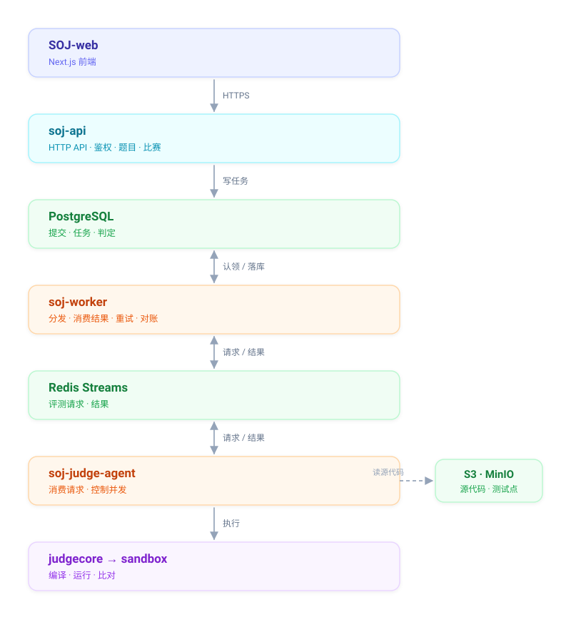

# Sundial Online Judge

[](https://go.dev/)
[](LICENSE)
[](https://github.com/sparklyi/SOJ/actions/workflows/ci.yml)

[English](README.md) | 简体中文

**在线体验：<http://43.172.84.99/>**

SOJ（Sundial Online Judge）是一个可以自己部署的在线评测系统，用来出题、办比赛和自动判题。

提交之后接口立刻返回，后台在隔离沙箱里编译运行代码，再把判定结果写回数据库。评测慢或者失败都
不会卡住接口，提交也不会丢。

本仓库是 Go 后端，前端在单独仓库 [SOJ-web](https://github.com/sparklyi/SOJ-web)，用 Next.js 写的。

## 架构



| 程序 | 职责 |
| --- | --- |
| `soj-api` | HTTP 接口（Gin）：鉴权、题目、提交、比赛。只写任务，不执行代码。 |
| `soj-worker` | 认领任务、投递评测请求、消费结果，处理重试、死信和对账。 |
| `soj-judge-agent` | 消费评测请求，按语言限制并发，跑 `judgecore`，投递结果。 |
| `soj-migrate` | 运行 PostgreSQL 迁移。 |

一次提交经过四步：

1. `POST /submissions` 写入提交和一条 `queued` 任务，返回 `202`。
2. worker 认领任务，把 `judge.request.v2` 投到 Redis Stream。
3. judge agent 消费后编译运行代码，投出 `judge.result.v1`。
4. worker 消费结果，写入判定。

接口和 judge agent 不直接通信，中间隔着 PostgreSQL 和 Redis。PostgreSQL 记录状态，Redis 只负责
传递消息，所以同一条消息被投两次也只会写出一条判定；进程中途挂掉，代价是多等一会儿，而不是提交
丢掉。只有 `soj-judge-agent` 能持有 Docker socket，跑用户代码的容器既拿不到 socket，也拿不到
任何凭据。

SOJ 自带 **7 种语言**：C、C++17、Go、Java、Node.js、Python 3、Rust。一门语言就是一个带
`language.yaml` 的目录，加语言只要加目录再重启 API。沙箱可以换：`fake`、`process`、`docker`
（gVisor/`runsc`），所以没有沙箱运行时也能把整个流程跑通。

## 快速开始

需要 Docker（Compose v2）。只有直接运行后端时才需要 Go 1.25。

```bash
make down
make up
make smoke
```

`make smoke` 会把完整流程跑一遍：注册、出题、上传测试点、发布、提交、评测、重测、办比赛、
看记分板。

| 服务 | 地址 |
| --- | --- |
| API | `http://localhost:8080` |
| Worker 健康检查 / 指标 | `http://localhost:8081` |
| Judge-agent 健康检查 / 指标 | `http://localhost:8082` |
| MinIO 控制台 | `http://localhost:9001` |
| Prometheus | `http://localhost:9090` |

不用容器，直接跑进程：

```bash
go run ./cmd/soj-migrate
go run ./cmd/soj-api
go run ./cmd/soj-worker
go run ./cmd/soj-judge-agent
```

前端在单独仓库：

```bash
git clone https://github.com/sparklyi/SOJ-web.git && cd SOJ-web
npm ci && cp .env.example .env.local && npm run dev   # http://localhost:3000
```

## 文档

| 文档 | 内容 |
| --- | --- |
| [docs/v2-architecture.md](docs/v2-architecture.md) | 模块划分、部署和可观测性 |
| [docs/v2-api-guide.md](docs/v2-api-guide.md) | API 约定和响应封装 |
| [docs/v2-worker.md](docs/v2-worker.md) | 分发、重试、死信和对账 |
| [docs/v2-deploy.md](docs/v2-deploy.md) | 配置和生产部署 |
| [docs/judge-runtime-readiness.md](docs/judge-runtime-readiness.md) | 沙箱就绪检查和恢复 |
| [docs/observability-trial-loop.md](docs/observability-trial-loop.md) | 看板、告警和 trace 排查 |

## 参与开发

欢迎提 issue 和 pull request。

先 fork 仓库，再 clone 你自己的 fork：

```bash
git clone https://github.com/<your-username>/SOJ.git
cd SOJ
git remote add upstream https://github.com/sparklyi/SOJ.git
git checkout -b fix/short-description
```

改完之后跑一遍检查：

```bash
make test            # go test ./...
make vet             # go vet ./...
make compose-config  # 校验所有 Compose 文件
```

把分支推上去，对 `main` 提 pull request。提交尽量聚焦，遵循 Conventional Commits。
CI 会跑同样的检查，外加一次 Docker smoke 测试。

## 许可证

以 [MIT 许可证](LICENSE) 发布。

联系：微信 `sparkyi1026` · 邮箱 `sparkyi@foxmail.com`
