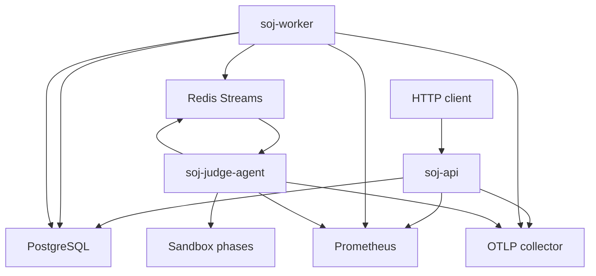

# Observability Trial Loop

## Problem Frame

SOJ v2 can now run the async judge path with API, worker, Redis Stream, object storage, judge-agent, Docker runner, readiness checks, recovery operations, and scoreboard snapshots. The next gap is operational diagnosis during trial deployment: when a submission is slow, lost, retried, dead-lettered, or produces an unexpected verdict, operators need one trace and one dashboard view that explain where time and failures happened.

This scope combines the selected ideation items: end-to-end OpenTelemetry tracing and production trial dashboards/alert rules. CI smoke/release-gate work is explicitly out of scope for this round.

## Requirements

**Tracing**

- R1. Tracing must be optional and disabled by default; enabling it must not be required for local development, tests, or normal Compose startup.
- R2. When tracing is enabled, one formal submission should produce a correlated trace across HTTP request handling, submission creation, judge task dispatch, Redis request consumption, judge-agent execution, Redis result publishing, result consumption, and final database projection.
- R3. Trace context must survive asynchronous boundaries. Redis judge request/result events should preserve enough context for worker and judge-agent spans to join the same trace rather than starting unrelated traces.
- R4. Existing `request_id` and `trace_id` behavior must remain useful: API responses still return `request_id`, judge attempts still expose `trace_id` in admin diagnostics, and trace identifiers should help an operator pivot between API responses, persisted attempts, logs, and traces.
- R5. Span attributes must avoid source code, testcase contents, credentials, DSNs, object storage secrets, JWTs, and other sensitive payloads. IDs, route names, statuses, verdicts, backend names, language identifiers, and duration/error classifications are acceptable.
- R6. Tracing should cover the high-value operational phases first: HTTP route latency, worker dispatch, result consumption, reconciliation/snapshot loop actions, judge-agent slot wait/processing, and sandbox prepare/compile/run/check/cleanup phases.
- R7. If the OTLP endpoint is unreachable, SOJ processes should continue running and surface the exporter problem through logs or metrics without failing normal judge execution.

**Dashboards And Alerts**

- R8. Add checked-in Prometheus alert rules for trial deployment signals: readiness failures, repeated dependency readiness errors, judge dispatch errors, dead/recovered task activity, result-consumer failures, judge-agent slot saturation, sandbox backend errors, sandbox cleanup failures, and elevated HTTP 5xx or latency.
- R9. Add a checked-in dashboard definition or dashboard query document that covers API health, worker queue flow, judge-agent capacity, sandbox phase latency, verdict/error distribution, readiness status, and recovery activity.
- R10. Add any missing low-cardinality metrics needed to make the dashboard and alerts actionable, especially queue backlog/oldest pending age and result-consumer error visibility. New labels must stay bounded and must not include user input, source text, full object keys, or unbounded error strings.
- R11. The local Prometheus configuration should be able to load the new alert rules for manual validation, without requiring CI changes.
- R12. Documentation must explain how to enable tracing, where traces are exported, which dashboard panels matter during trial deployment, which alerts are expected to page or warn, and how to pivot from an alert to a trace or persisted judge attempt.

**Scope Control**

- R13. Do not modify GitHub Actions or add CI smoke/release-gate jobs in this scope.
- R14. Do not introduce a required Grafana service in the default Compose stack. A dashboard artifact or documented PromQL panel set is acceptable; adding a UI service can be considered later.
- R15. Do not change judge scheduling semantics, retry policy, scoreboard behavior, sandbox selection, or rejudge behavior except where small metrics/tracing hooks are needed.
- R16. Do not expose tracing or metrics endpoints publicly by default; existing guidance that `/metrics` belongs on a private network or behind ingress protection remains in force.

## Success Criteria

- With tracing disabled, existing unit tests, vet, Compose config validation, and local runtime behavior remain unchanged.
- With tracing enabled and an OTLP collector configured, a single accepted smoke submission can be followed through API, worker, judge-agent, sandbox phase spans, result consumption, and final persistence in one trace.
- Admin diagnostics for a judged submission include a trace identifier that matches or clearly maps to the exported trace.
- Prometheus loads the checked-in alert rules locally without syntax errors.
- Dashboard queries or dashboard artifact use the metrics exported by API, worker, and judge-agent and avoid unbounded labels.
- Documentation gives an operator a concrete path from "queue is stuck" or "sandbox errors increased" to the relevant metric, trace, and recovery action.
- No GitHub Actions workflow files are changed for this scope.

## Scope Boundaries

- CI workflow improvements are deferred by user request.
- Problem data validation, rejudge batch APIs, OpenAPI client generation, and production config fail-fast guards remain separate future work.
- This scope does not require adding a tracing backend, Grafana, Alertmanager, or hosted monitoring stack to Compose. It only makes SOJ emit and document the signals cleanly.
- This scope does not require changing user-facing API response shapes except preserving the existing `request_id` envelope and existing admin diagnostics behavior.

## Key Decisions

- Combine tracing and dashboards/alerts into one observability trial loop: these features reinforce each other because alerts identify the symptom and tracing explains the path.
- Keep CI out of scope: the user explicitly selected items 1 and 3 and said the CI flow does not need to be filled in.
- Keep tracing off by default: local development and current tests should not need collector infrastructure.
- Prefer checked-in Prometheus rules and dashboard queries over adding a new dashboard service: SOJ already ships Prometheus config, while adding Grafana would expand deployment surface.

## Dependencies / Assumptions

- Current Prometheus metrics live under `internal/observability/metrics.go`, and local scraping is configured in `deploy/prometheus.yml`.
- Current request IDs are created by HTTP middleware and returned in response envelopes.
- Current judge request/result events and persisted judge attempts already carry `trace_id`; planning should decide how to align that with W3C trace context and OpenTelemetry trace IDs.

## Outstanding Questions

### Resolve Before Planning

- None.

### Deferred to Planning

- [Affects R1-R7][Technical] Decide the exact OpenTelemetry package layout, environment variables, sampler defaults, shutdown behavior, and exporter error handling.
- [Affects R3-R4][Technical] Decide whether persisted `trace_id` should be the OpenTelemetry trace ID, a stable SOJ correlation ID, or both.
- [Affects R8-R11][Technical] Decide the concrete dashboard artifact format: Markdown PromQL panel guide, Grafana JSON, or both.
- [Affects R10][Needs research] Identify the minimal additional queue/result-consumer metrics that can be collected cheaply without high-cardinality labels.

## Next Steps

-> `/ce:plan` for structured implementation planning.
