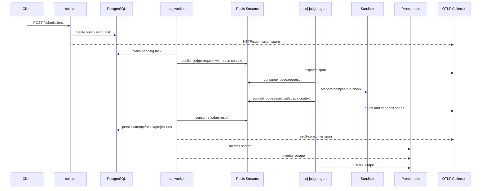

# feat: Add observability trial loop

## Overview

Add an opt-in observability trial loop for SOJ's async judge path: OpenTelemetry traces for API, worker, judge-agent, Redis event handoffs, and sandbox phases, plus Prometheus alert rules and dashboard queries for trial deployment. The work keeps tracing disabled by default, keeps CI untouched, and does not add a required Grafana or tracing backend service.

## Problem Frame

SOJ already has API/worker/judge-agent metrics, readiness checks, recovery operations, and Docker runner support. Operators still lack a single correlated path from "this submission is slow or stuck" to the exact API request, worker dispatch, Redis event, judge-agent execution, sandbox phase, result consumer write, and persisted judge attempt. This plan implements the observability scope selected from the origin document: tracing plus dashboards/alerts, explicitly excluding CI workflow changes (see origin: `docs/brainstorms/2026-07-06-observability-trial-loop-requirements.md`).

## Requirements Trace

- R1. Tracing is optional and disabled by default.
- R2. A formal submission can be traced across HTTP, worker dispatch, Redis request consumption, judge-agent execution, Redis result publishing, result consumption, and final persistence.
- R3. Trace context survives Redis request/result event boundaries.
- R4. Existing `request_id` responses and persisted `trace_id` admin diagnostics remain useful.
- R5. Spans and metrics avoid source code, testcase contents, secrets, DSNs, JWTs, unbounded error strings, and full object keys.
- R6. High-value operational phases are traced first: HTTP routes, dispatch, result consumption, reconciliation/snapshots, judge-agent slot wait/processing, and sandbox phases.
- R7. OTLP exporter failures do not fail normal SOJ execution.
- R8. Checked-in Prometheus alert rules cover readiness, dispatch/result failures, dead/recovered tasks, slot saturation, sandbox failures, and HTTP 5xx/latency.
- R9. Checked-in dashboard artifact covers API health, worker queue flow, judge-agent capacity, sandbox latency, verdict/error distribution, readiness, and recovery.
- R10. Add only missing low-cardinality metrics needed for actionable alerts and dashboards.
- R11. Local Prometheus can load alert rules without CI changes.
- R12. Docs explain how to enable tracing, use dashboard panels, interpret alerts, and pivot to traces or persisted attempts.
- R13. Do not modify GitHub Actions or add CI smoke/release-gate jobs.
- R14. Do not introduce a required Grafana service in the default Compose stack.
- R15. Do not change judge scheduling, retry, scoreboard, sandbox selection, or rejudge semantics except for small observability hooks.
- R16. Do not expose metrics or tracing publicly by default.

## Scope Boundaries

- No changes to `.github/workflows/`.
- No default Grafana, Alertmanager, Jaeger, Tempo, or collector service in `deploy/docker-compose.yaml`.
- No changes to judge scheduling, retry semantics, scoreboard snapshot behavior, sandbox backend selection, or rejudge behavior.
- No user-facing API response shape changes beyond preserving existing `request_id` behavior.
- No problem validation, rejudge API, OpenAPI client, or production config fail-fast work.

## Context & Research

### Relevant Code and Patterns

- `internal/observability/metrics.go` owns a per-process Prometheus registry, metric definitions, and recording methods.
- `internal/httpapi/middleware.go` creates `X-Request-ID`; `internal/httpapi/router.go` installs request ID, metrics middleware, health/readiness, and `/metrics`.
- `internal/app/api.go`, `internal/app/worker.go`, and `internal/app/judge_agent.go` assemble process dependencies and are the right startup/shutdown points for tracing providers.
- `internal/submission/worker.go` creates judge request events and existing synthetic `trace_id` values.
- `internal/judge/events/events.go` requires `trace_id` on request/result/progress/dead-letter event contracts.
- `internal/submission/async.go` handles judge-agent request processing and result event publishing.
- `internal/app/worker.go` runs dispatch, result-consumer, and reconciler loops; result-consumer errors currently return from the loop without dedicated metrics.
- `internal/queue/redis_stream.go` wraps Redis Stream publish/consume/readiness but does not yet expose queue depth or oldest-pending-age metrics.
- `deploy/prometheus.yml` scrapes API, worker, and judge-agent but has no `rule_files` entry.
- `docs/v2-deploy.md` and `docs/v2-architecture.md` already describe tracing as the next observability phase.

### Institutional Learnings

- No `docs/solutions/` learnings were present in this repository at planning time.

### External References

- OpenTelemetry Go getting-started docs describe manual instrumentation for Go and current Go prerequisites: <https://opentelemetry.io/docs/languages/go/getting-started/>
- OpenTelemetry OTLP exporter configuration documents standard `OTEL_EXPORTER_OTLP_*` environment variables: <https://opentelemetry.io/docs/languages/sdk-configuration/otlp-exporter/>
- `otelgin` is the OpenTelemetry contrib package for Gin middleware: <https://pkg.go.dev/go.opentelemetry.io/contrib/instrumentation/github.com/gin-gonic/gin/otelgin>
- `otlptracehttp` is the OTLP/HTTP trace exporter and supports environment-based configuration: <https://pkg.go.dev/go.opentelemetry.io/otel/exporters/otlp/otlptrace/otlptracehttp>
- Prometheus rule files are configured through `rule_files`; alerting rules evaluate PromQL expressions into firing alerts: <https://prometheus.io/docs/prometheus/latest/configuration/recording_rules/> and <https://prometheus.io/docs/prometheus/latest/configuration/alerting_rules/>

## Key Technical Decisions

- **Create a small internal tracing facade:** Put OpenTelemetry setup and helpers behind `internal/observability` so app packages do not spread provider/exporter configuration.
- **Use opt-in `SOJ_TRACING_ENABLED`:** Do not export traces just because generic `OTEL_*` variables are present. `SOJ_TRACING_ENABLED=true` enables tracing; standard `OTEL_EXPORTER_OTLP_*`, `OTEL_SERVICE_NAME`, and `OTEL_RESOURCE_ATTRIBUTES` can still configure exporter/resource details.
- **Prefer OTLP/HTTP first:** Use OTLP/HTTP for the initial exporter because it is simple to run against standard collectors and has a clear `otlptracehttp` package. Planning does not forbid a later gRPC option.
- **Keep persisted `trace_id` compatible:** When tracing is enabled, persist the OpenTelemetry trace ID in the existing `trace_id` field and propagate W3C trace context through event payloads. When disabled, keep the existing deterministic SOJ fallback trace ID format.
- **Propagate W3C context separately from business IDs:** Add event-level trace context fields rather than overloading `trace_id` with serialized propagation headers. `trace_id` remains an operator pivot ID.
- **Use low-cardinality queue names:** New queue metrics should label logical queues such as `request` and `result`, not raw stream names, object keys, source text, or error messages.
- **Use dashboard-as-doc first:** Ship a Markdown PromQL dashboard guide instead of Grafana JSON for this round. It satisfies the requirement without adding UI service coupling; Grafana JSON can be generated later from stable panel choices.
- **Prometheus alert rules are warning/page shaped but local-only:** Check in alert groups and load them in local Prometheus. This does not require Alertmanager or CI changes.

## Open Questions

### Resolved During Planning

- **Should CI be updated?** No. The user explicitly said the CI flow does not need to be filled in; `.github/workflows/` remains untouched.
- **Should Grafana be added?** No. Use a checked-in dashboard query document for now.
- **Should `trace_id` be replaced?** No. Preserve the existing field and use it as the operator pivot; when tracing is enabled, align it with the OpenTelemetry trace ID where practical.
- **Should exporter failure stop the service?** No. Tracing is diagnostic; exporter failures should be logged/metriced and normal request/judge execution should continue.

### Deferred to Implementation

- Exact OpenTelemetry dependency versions after `go get`.
- Exact helper names and function boundaries inside `internal/observability`.
- Final list of queue stats exposed by Redis with acceptable cost under local testing.
- Exact alert thresholds after seeing local metric names and sample values.

## High-Level Technical Design

> *This illustrates the intended approach and is directional guidance for review, not implementation specification. The implementing agent should treat it as context, not code to reproduce.*

## Phased Delivery

### Phase 1: Trace Foundation

- Land Unit 1 first so the rest of the system has one opt-in tracing facade and one shutdown contract.
- Land Unit 2 after Unit 1 to prove HTTP/process span behavior without changing judge event contracts.

### Phase 2: Async Context and Metrics

- Land Unit 3 after Unit 2 so Redis event trace context can be tested against active spans and existing fallback `trace_id` behavior.
- Land Unit 4 after or alongside Unit 3 once file conflicts in worker and queue packages are coordinated. Unit 4 does not require tracing to be enabled, but it does share app and observability surfaces.

### Phase 3: Operator Handoff

- Land Unit 5 last so docs and dashboard queries use final metric names, alert names, and trace enablement behavior.

## Alternative Approaches Considered

- **Use only Prometheus metrics:** Rejected because metrics can show symptoms but cannot explain a single submission's cross-process path through Redis and the judge-agent.
- **Add Grafana to default Compose:** Rejected for this scope because the origin document prefers no required dashboard service; a Markdown dashboard guide keeps deployment surface small.
- **Use only generic `OTEL_*` env vars to enable tracing:** Rejected because SOJ should remain quiet by default even when generic environment is present on a host. `SOJ_TRACING_ENABLED` is the explicit gate.
- **Store serialized W3C context in `trace_id`:** Rejected because `trace_id` is already an operator-facing persisted field. Propagation context should be carried separately so admin diagnostics stay readable.

## Implementation Units

- [x] **Unit 1: Tracing configuration and lifecycle**

**Goal:** Add opt-in OpenTelemetry setup that each process can initialize and shut down without changing normal behavior when disabled.

**Requirements:** R1, R5, R7, R16

**Dependencies:** None

**Files:**
- Create: `internal/observability/tracing.go`
- Create: `internal/observability/tracing_test.go`
- Modify: `internal/config/config.go`
- Modify: `internal/config/config_test.go`
- Modify: `internal/app/api.go`
- Modify: `internal/app/worker.go`
- Modify: `internal/app/judge_agent.go`
- Modify: `go.mod`
- Modify: `go.sum`

**Approach:**
- Add tracing configuration to `config.Config`, including an explicit enabled flag and service/resource settings.
- Initialize a no-op path when tracing is disabled so callers can use helpers without nil branching.
- When enabled, create a tracer provider with service name, resource attributes, sampler, batch span processor, and OTLP/HTTP exporter.
- Return a shutdown function from setup and call it from API, worker, and judge-agent process assembly.
- Log or metric exporter/setup failures according to severity: invalid config should return a startup error only if tracing is explicitly enabled and cannot be configured; transient export failures should not fail request or judge execution.

**Execution note:** Add tests for disabled/default behavior before wiring process startup.

**Patterns to follow:**
- `internal/observability/metrics.go` for process-scoped observability setup.
- `internal/config/config.go` and `internal/config/config_test.go` for environment parsing patterns.
- `internal/app/api.go`, `internal/app/worker.go`, `internal/app/judge_agent.go` for process lifecycle and shutdown patterns.

**Test scenarios:**
- Happy path: no tracing env vars -> config loads with tracing disabled and no exporter setup required.
- Happy path: `SOJ_TRACING_ENABLED=true` plus OTLP endpoint -> setup returns an active shutdown function and service name is process-specific.
- Edge case: invalid tracing boolean -> config load returns a clear `SOJ_TRACING_ENABLED` parse error.
- Error path: exporter setup fails while tracing is explicitly enabled -> startup reports a configuration/setup error.
- Integration: API/worker/judge-agent startup paths call tracing shutdown during normal process shutdown without panics.

**Verification:**
- Tracing disabled remains the default and does not require an OTLP collector.
- Existing process startup tests and config tests cover the new lifecycle surface.

- [x] **Unit 2: HTTP and process span instrumentation**

**Goal:** Add spans around HTTP routes and long-running worker/judge-agent process loops while preserving existing request ID and metrics behavior.

**Requirements:** R2, R4, R5, R6, R7

**Dependencies:** Unit 1

**Files:**
- Modify: `internal/httpapi/router.go`
- Modify: `internal/httpapi/middleware.go`
- Modify: `internal/httpapi/response_test.go`
- Modify: `internal/app/worker.go`
- Modify: `internal/app/judge_agent.go`
- Modify: `internal/app/readiness_test.go`
- Modify: `internal/app/judge_agent_slots_test.go`
- Test: `internal/httpapi/response_test.go`
- Test: `internal/app/readiness_test.go`
- Test: `internal/app/judge_agent_slots_test.go`

**Approach:**
- Install `otelgin` middleware only when tracing is enabled or when a non-noop tracer provider is configured, keeping middleware ordering compatible with request IDs and existing Prometheus metrics.
- Add route/status/request ID attributes through safe bounded values; do not attach bodies, source code, auth headers, or internal credential values.
- Start spans for worker dispatch loop iterations, result-consumer message processing, reconciler loop actions, judge-agent consume/acquire/process operations, and slot wait time where useful.
- Keep errors attached to spans using normalized classes and statuses rather than raw unbounded internal messages.

**Patterns to follow:**
- `internal/httpapi.RecordHTTPMetrics` for route normalization.
- `internal/app.runDispatchLoop`, `runResultConsumerLoop`, `runReconcilerLoop`, and `runJudgeAgentLoop` for loop boundaries.
- Existing request ID handling in `internal/httpapi.RequestID`.

**Test scenarios:**
- Happy path: HTTP router with tracing disabled still returns `request_id` and records metrics as before.
- Happy path: HTTP router with tracing enabled creates route-level spans with normalized route labels.
- Edge case: unmatched route span uses bounded route name and still returns the existing error envelope.
- Error path: a readiness failure records an error span status without exposing dependency error details in the HTTP response.
- Integration: judge-agent slot processing spans do not change message acknowledgement/dead-letter behavior.

**Verification:**
- HTTP request ID behavior and Prometheus metrics behavior remain unchanged with tracing disabled.
- Tracing-enabled tests can observe span names/attributes through an in-memory exporter or test span recorder.

- [x] **Unit 3: Async judge trace propagation**

**Goal:** Carry trace context across Redis request/result events and persist an operator-useful trace ID in judge attempts.

**Requirements:** R2, R3, R4, R5, R6

**Dependencies:** Unit 1, Unit 2

**Files:**
- Modify: `internal/judge/events/events.go`
- Modify: `internal/judge/events/events_test.go`
- Modify: `internal/submission/worker.go`
- Modify: `internal/submission/async.go`
- Modify: `internal/submission/service_test.go`
- Modify: `internal/submission/repository.go`
- Test: `internal/judge/events/events_test.go`
- Test: `internal/submission/service_test.go`

**Approach:**
- Extend judge event contracts with a compact trace context carrier that can encode W3C trace context without changing business identity semantics.
- During dispatch, derive the persisted `trace_id` from the current OpenTelemetry span when tracing is active; otherwise keep the existing deterministic `trace-submission-...` fallback.
- Inject trace context into request events before publishing to Redis.
- Extract trace context in judge-agent request processing and create child spans for source fetch, core judge execution, result normalization, result publish, and ack/dead-letter.
- Propagate trace context from request event to result event so the worker result consumer can continue the trace and persist terminal result spans.
- Preserve validation for required `trace_id` while allowing trace context to be absent when tracing is disabled.

**Patterns to follow:**
- Existing `RequestEvent`, `ResultEvent`, and validation tests in `internal/judge/events`.
- Existing `Worker.requestEvent` and `publishAsyncResult` propagation of `TraceID`.
- Existing admin diagnostics tests that assert `trace_id` visibility.

**Test scenarios:**
- Happy path: request event created under an active span contains both `trace_id` and trace context; result event preserves both.
- Happy path: tracing disabled creates a valid request event with the existing fallback `trace_id` and no trace context.
- Edge case: incoming event has `trace_id` but no trace context -> judge-agent processes it successfully and starts a local span.
- Error path: malformed trace context is ignored or normalized without rejecting otherwise valid judge events.
- Integration: result consumer persists the same operator trace ID that admin diagnostics expose for a completed submission.

**Verification:**
- A traced formal submission can be followed through dispatch, judge-agent, result publish, result consume, and persisted attempt using the same trace/correlation identity.

- [x] **Unit 4: Actionable metrics and Prometheus rules**

**Goal:** Add missing low-cardinality metrics and checked-in alert rules that make trial deployment issues visible without adding CI or Alertmanager dependencies.

**Requirements:** R5, R8, R10, R11, R16

**Dependencies:** Unit 1 is optional; this unit can be implemented after or in parallel with Unit 2 if file conflicts are managed.

**Files:**
- Modify: `internal/observability/metrics.go`
- Modify: `internal/observability/metrics_test.go`
- Modify: `internal/queue/queue.go`
- Modify: `internal/queue/redis_stream.go`
- Modify: `internal/queue/redis_stream_test.go`
- Modify: `internal/app/worker.go`
- Modify: `internal/submission/async.go`
- Modify: `internal/submission/service_test.go`
- Modify: `deploy/prometheus.yml`
- Create: `deploy/prometheus-rules/soj-alerts.yml`
- Test: `internal/observability/metrics_test.go`
- Test: `internal/queue/redis_stream_test.go`
- Test: `internal/submission/service_test.go`

**Approach:**
- Add queue gauges/counters with bounded labels: logical queue (`request`, `result`) and bounded result/status labels only.
- Add result-consumer processing metrics separate from legacy/synchronous judge task processing metrics.
- Add queue depth and oldest-pending-age collection through a queue stats interface implemented by Redis Stream queues. Use logical queue names supplied by app wiring rather than raw stream values.
- Add alert rules for readiness dependency failures, HTTP 5xx/latency, dispatch/result-consumer failures, dead/recovery activity, slot saturation, sandbox backend errors, sandbox cleanup failures, and queue backlog/oldest age.
- Update `deploy/prometheus.yml` with `rule_files` pointing at the checked-in rules.

**Patterns to follow:**
- Existing metric registration and tests in `internal/observability/metrics.go`.
- Existing Redis readiness check shape in `internal/queue/redis_stream.go`.
- Existing smoke metric checks in `deploy/smoke.sh` for expected metric availability, without modifying CI.

**Test scenarios:**
- Happy path: new metrics are registered and exposed by `Metrics.Handler()`.
- Happy path: Redis queue stats returns stream length and pending/oldest-age values for a known Redis response shape.
- Edge case: missing stream/group stats report zero or a bounded error result without panicking.
- Error path: result-consumer processing error increments an error counter with bounded labels.
- Integration: Prometheus config references the new rule file path and the rule file YAML structure is loadable by Prometheus.

**Verification:**
- Local Prometheus can load scrape config plus alert rule file.
- New metrics have bounded label names and no user-controlled or secret values.

- [x] **Unit 5: Dashboard guide and operational documentation**

**Goal:** Document how to enable tracing, interpret alerts, use dashboard queries, and pivot from symptoms to traces and persisted attempts.

**Requirements:** R8, R9, R11, R12, R13, R14, R16

**Dependencies:** Unit 3 and Unit 4 for final metric and trace names.

**Files:**
- Create: `docs/observability-trial-loop.md`
- Modify: `docs/v2-deploy.md`
- Modify: `docs/v2-architecture.md`
- Modify: `docs/judge-runtime-readiness.md`
- Modify: `README.md`
- Modify: `README.zh-CN.md`
- Test expectation: none -- documentation-only unit; verification is link/path consistency and alignment with implemented metric names.

**Approach:**
- Add a dashboard guide with PromQL panels for API health, worker queue flow, result consumer health, judge-agent slot capacity/saturation, sandbox phase latency, sandbox failures, readiness failures, and recovery activity.
- Document tracing enablement using `SOJ_TRACING_ENABLED` and standard `OTEL_*` variables.
- Document a symptom-to-signal workflow: queue stuck, result events missing, sandbox errors increasing, readiness failing, and unexpected verdict diagnostics.
- Update existing deploy/readiness docs so they reference alert rules and tracing without implying new mandatory services.
- Preserve existing warning that `/metrics` should stay private or ingress-protected.

**Patterns to follow:**
- `docs/judge-runtime-readiness.md` for operational checklist tone.
- `docs/v2-deploy.md` for deployment-oriented environment and metrics docs.
- README roadmap style for concise links to detailed docs.

**Test scenarios:**
- Test expectation: none -- documentation-only unit.

**Verification:**
- Docs reference only implemented metric names and alert file paths.
- Docs clearly state that CI, Grafana, Alertmanager, and tracing backend services are not part of this scope.

## System-Wide Impact

- **Interaction graph:** Adds observability hooks across HTTP middleware, app process assembly, worker loops, judge-agent loops, Redis judge events, sandbox observer callbacks, Prometheus config, and docs.
- **Error propagation:** Tracing export failures should not propagate into API, worker, or judge execution errors. Alert rule load errors are configuration-time issues for Prometheus, not SOJ process failures.
- **State lifecycle risks:** Trace context must not break event validation, duplicate Redis messages, idempotent terminal writes, or existing fallback `trace_id` behavior.
- **API surface parity:** HTTP response envelopes keep `request_id`; admin diagnostics keep `trace_id`; no OpenAPI response shape change is intended.
- **Integration coverage:** Unit tests should cover config/defaults, event propagation, result-consumer metrics, queue stats, and router behavior. Manual local validation should cover one traced submission with an OTLP collector when implementation reaches verification.
- **Unchanged invariants:** No CI workflow changes, no default Grafana/collector service, no scheduling/retry/scoreboard behavior changes, no public metrics exposure by default.

## Risks & Dependencies

| Risk | Mitigation |
|------|------------|
| OpenTelemetry setup spreads across app packages and becomes hard to maintain. | Centralize setup and helpers in `internal/observability`; app packages only initialize and pass contexts. |
| Persisted `trace_id` changes break existing tests or operator expectations. | Keep fallback format when tracing is disabled and update tests to assert compatibility. |
| Trace context fields break older event validation assumptions. | Add optional trace context fields while keeping `trace_id` required; update event contract tests. |
| Metrics labels accidentally include high-cardinality or sensitive values. | Limit labels to service, logical queue, route, status, result, backend, phase, class, scope, and language. Avoid stream names, object keys, source text, and raw errors. |
| Alert thresholds are noisy before real traffic baselines exist. | Mark initial alert severity as trial-oriented and document threshold tuning. |
| Prometheus rule syntax drifts from local config. | Keep rules under `deploy/prometheus-rules/` and wire them through `deploy/prometheus.yml` for local validation. |

## Documentation / Operational Notes

- Add tracing enablement instructions and state clearly that tracing is off by default.
- Document standard OTLP environment variables as pass-through configuration, with `SOJ_TRACING_ENABLED` as the SOJ-specific gate.
- Document dashboard queries as a first-class artifact, not as a Grafana dependency.
- Document alert severity and expected operator action for each alert group.
- Keep README changes concise and link to detailed docs.

## Sources & References

- **Origin document:** `docs/brainstorms/2026-07-06-observability-trial-loop-requirements.md`
- **Ideation source:** `docs/ideation/2026-07-06-soj-next-steps-ideation.md`
- Related code: `internal/observability/metrics.go`
- Related code: `internal/httpapi/router.go`
- Related code: `internal/app/api.go`
- Related code: `internal/app/worker.go`
- Related code: `internal/app/judge_agent.go`
- Related code: `internal/submission/worker.go`
- Related code: `internal/submission/async.go`
- Related code: `internal/judge/events/events.go`
- Related config: `deploy/prometheus.yml`
- OpenTelemetry Go docs: <https://opentelemetry.io/docs/languages/go/getting-started/>
- OpenTelemetry OTLP exporter config: <https://opentelemetry.io/docs/languages/sdk-configuration/otlp-exporter/>
- OpenTelemetry Gin middleware: <https://pkg.go.dev/go.opentelemetry.io/contrib/instrumentation/github.com/gin-gonic/gin/otelgin>
- OpenTelemetry OTLP/HTTP trace exporter: <https://pkg.go.dev/go.opentelemetry.io/otel/exporters/otlp/otlptrace/otlptracehttp>
- Prometheus rule files: <https://prometheus.io/docs/prometheus/latest/configuration/recording_rules/>
- Prometheus alerting rules: <https://prometheus.io/docs/prometheus/latest/configuration/alerting_rules/>
